# ssh-brute-force-detector

The tremendous growth in electronic network and web usage, combined with the growing range of attacks makes network security a subject of significant concern. One amongst the foremost current network attacks which will threaten computers connected to the network may be a brute force attack. On-line brute force and dictionary attacks against network services and web applications are omnipresent. During this work, I present their taxonomy from the attitude of network flows. This contributes to a transparent analysis of detection strategies and provides a stronger understanding of the brute force attacks inside the analysis community.

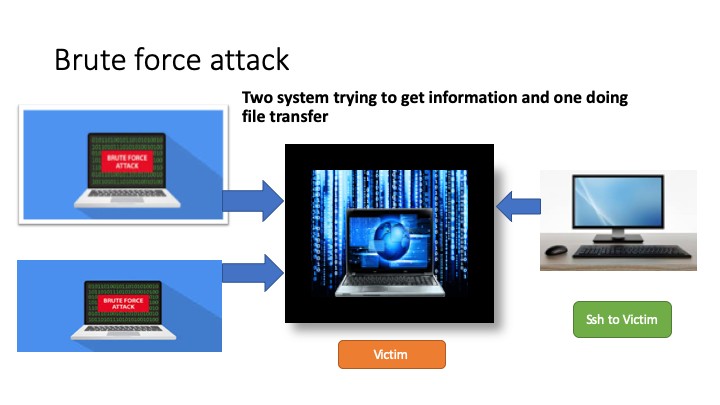
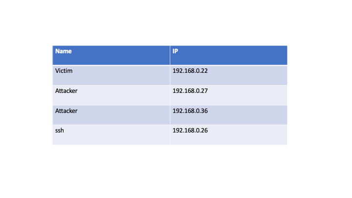
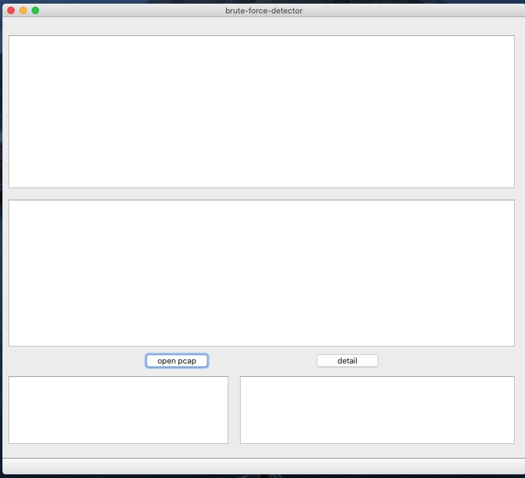
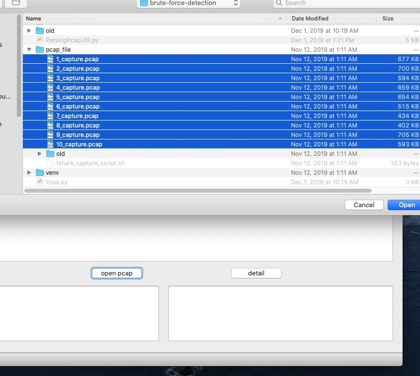
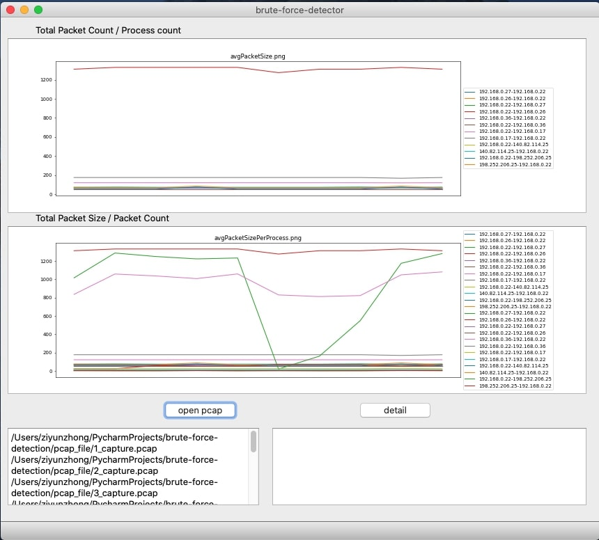
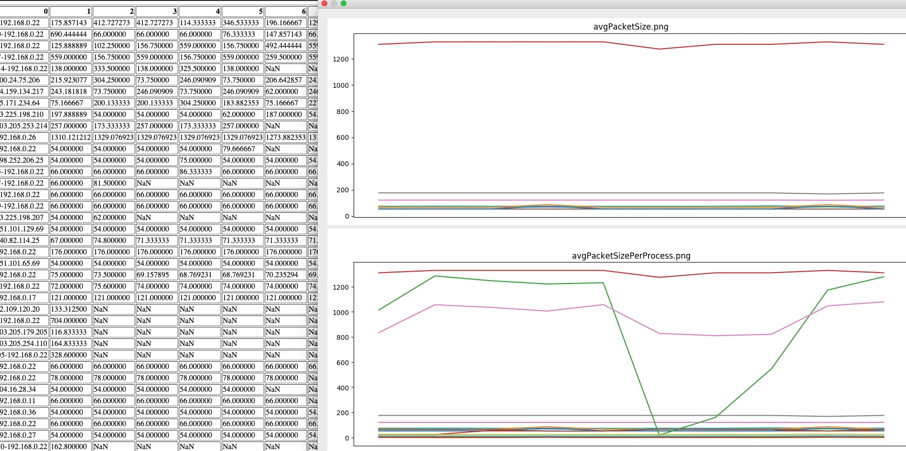
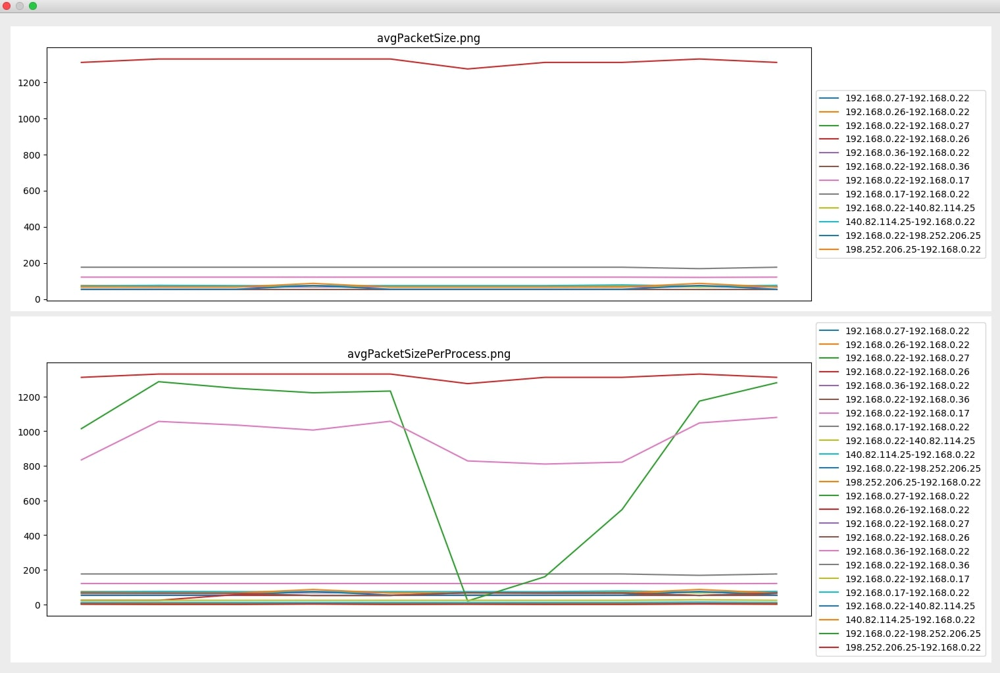

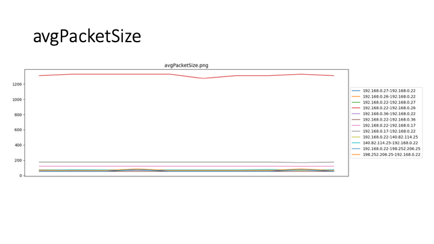
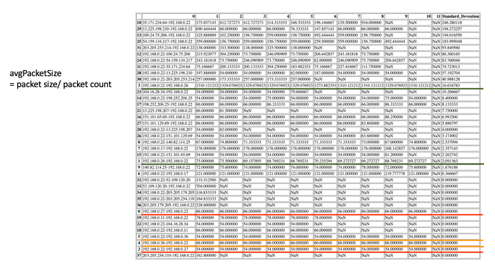
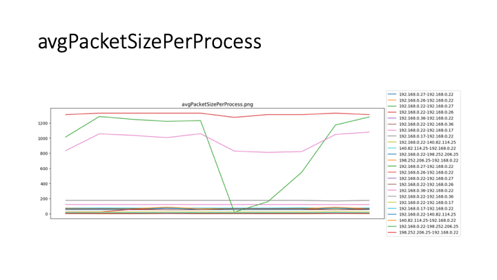
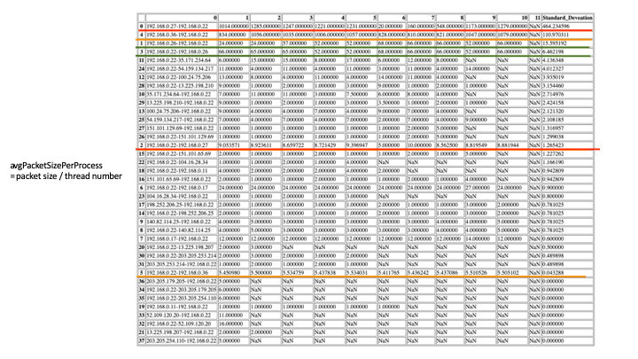

**How to detect Brute force attack**

To judge data fluctuation, you must first statistically process the traffic. The judgment steps are as follows:

- Step 1 - Use the packet capture tool to capture the packets passing through the network card and save them as pcap files N i ( i = 1, 2, 3, ...) in min units .
- Step 2 - resolve the quintuples in N i (source IP address, source port, destination IP address, destination port, and application layer protocol).
- Step 3 - Reserved N I data packet containing a useful protocol, the packetized data, the same source IP data packets to the destination IP grouped.
- Step 4 - According to the header information, calculate the total size T i of each packet, the number of packets B i, and calculate the average size of each packet.t¯i= TiBi and the average number of packets sent by the processb¯i= BiPi.
onclusion, sometimes recent, boring attacks will work even as well because the new, exciting ones. Low-tech because it could be, a brute force attack will be terribly effective at compromising your web application unless correct defenses are used. The primary and foremost technique of defeating a brute force attack is to want all users to decide on a robust secret. Passwords ought to be needed to contain a minimum of seven characters, with mixed upper- and lower-case letters, numbers, and punctuation. Also, think about implementing an incrementing response delay routine in your application in place of an automatic account opposition. Finally, make certain to show nondescript, ambiguous login failure messages like &quot;Invalid username or secret.&quot; Messages like this give no further info regarding the system that a hacker employing a dictionary attack will make the most of to lighten his work. Following these pointers can assist you defend your application and your users from the brutes of the globe.

**Author**

[@gbsunmonu](https://github.com/gbsunmonu)

[@tobyzhong](https://github.com/zhongziyun1993)

